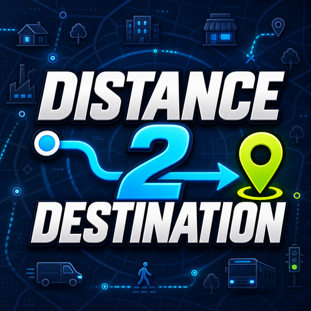

Distance 2 Destination is a **Cities: Skylines (CS1)** mod that shows how far a selected vehicle or walking citizen has left to travel.

**[Steam Workshop Item](https://steamcommunity.com/sharedfiles/filedetails/?id=3789370121)**

## Features

- Shows the remaining route distance in the normal information window.
- Supports service vehicles, other road vehicles, and pedestrians.
- Supports metric and imperial units.
- Hides the field when there is no useful active trip to display.
- Updates automatically as the selected vehicle or citizen moves.

## Requirements

- Cities: Skylines 1 version 1.21.1-f9 or later
- [Harmony 2.2.2-0 (Mod Dependency)](https://steamcommunity.com/sharedfiles/filedetails/?id=2040656402)

Distance 2 Destination does not include Harmony itself. Subscribe to the Harmony dependency before using the mod.

## Using the mod

Enable **Distance 2 Destination vx.x.x** in Content Manager, load a city, and select a moving road vehicle or pedestrian. The remaining distance appears below the normal activity line.

Open **Options > Mods Settings > Distance 2 Destination vx.x.x** to choose what the mod displays and whether it uses metric or imperial units.

## Documentation

- [User guide](docs/UserGuide.md)
- [Development and building](docs/Development.md)
- [Technical design](docs/TechnicalDesign.md)
- [Verification checklist](docs/Verification.md)

## License

Distance 2 Destination is licensed under the MIT License.
