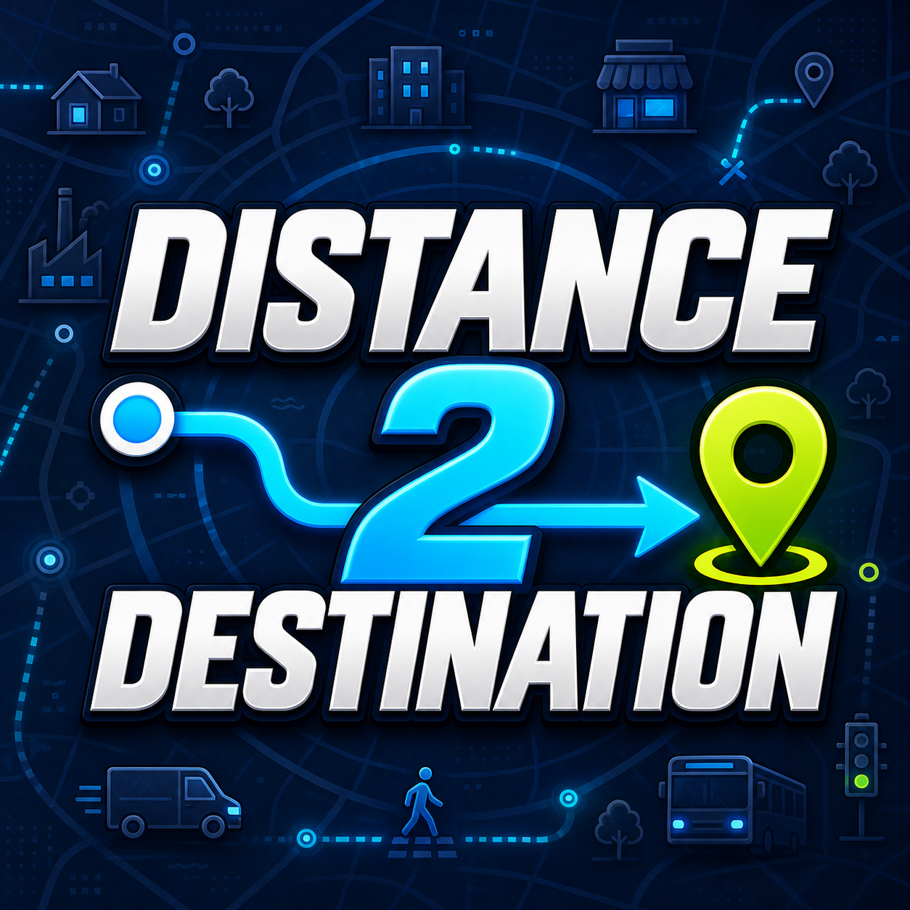

  

    
    
    
    
    
    
  

  
Shows the remaining distance along a selected citizen or road vehicle's existing route.

  

    <a href="#features">Features</a> •
    <a href="#showcase">Showcase</a> •
    <a href="#quick-start">Quick Start</a> •
    <a href="#development">Development</a> •
    <a href="#guides">Guides</a>
  

---

## Features

- 🛣️ Shows the remaining route distance in the normal information window.
- 🚚 Supports service vehicles, other road vehicles, bicycles, and pedestrians.
- 📏 Supports metric and imperial units.
- 🙈 Hides the field when there is no useful active trip to display.
- 🔄 Updates automatically as the selected vehicle or citizen moves.

## Showcase

Runtime screenshots are not currently included in the repository.

## Quick start

1. Install Cities: Skylines 1 version 1.21.1-f9 or later.
2. Subscribe to [Harmony 2.2.2-0 (Mod Dependency)](https://steamcommunity.com/sharedfiles/filedetails/?id=2040656402); Distance 2 Destination does not include Harmony itself.
3. Install [Distance 2 Destination from the Steam Workshop](https://steamcommunity.com/sharedfiles/filedetails/?id=3789370121).
4. In **Content Manager > Mods**, enable **Distance 2 Destination v1.1.8**, load a city, and select a moving road vehicle, bicycle, or pedestrian.

### Configuration overview

| Section | Configure | Available options |
| --- | --- | --- |
| `Show distance for` | Choose the entity categories that display distance. | `Service vehicles`, `All other vehicles`, `Pedestrians` |
| `Units` | Choose the distance format. | `Metric (m, km)`, `Imperial (ft, mi)` |

Open **Options > Mods Settings > Distance 2 Destination v1.1.8** to change these settings.

## Development

For the complete setup and local-installation procedure, see [Development and building](docs/Development.md).

| Need | Command |
| --- | --- |
| Restore dependencies | `nuget restore packages.config -PackagesDirectory packages` |
| Build a Release DLL | `msbuild DistanceToDestination.csproj /p:Configuration=Release` |

Before building against a nonstandard game installation, copy `Directory.Build.user.props.example` to `Directory.Build.user.props` and set `CitiesSkylinesManagedDir`. The local props file is ignored by Git.

## Guides

Choose a guide by task, or browse the complete [documentation hub](docs/README.md):

| I want to… | Start here |
| --- | --- |
| Install the mod or change settings | [User guide](docs/UserGuide.md) |
| Restore dependencies, build, or install locally | [Development and building](docs/Development.md) |
| Understand route calculations and UI integration | [Technical design](docs/TechnicalDesign.md) |
| Run the recommended checks | [Verification checklist](docs/Verification.md) |

## Tech stack

  
  
  

---

## License

Distributed under the [MIT License](LICENSE).
